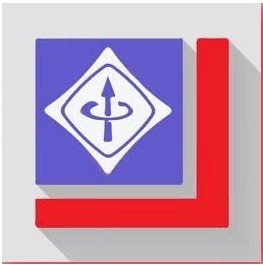

  
  <h1>IEEE BPIT</h1>
  
<strong>Bhagwan Parshuram Institute of Technology, Delhi</strong>

  
Where Creativity meets Innovation

  
Explore. Build. Lead.

---

## About Us

IEEE BPIT is the official student branch of the **Institute of Electrical and Electronics Engineers** at Bhagwan Parshuram Institute of Technology, Delhi. Established in 2015, we are part of the IEEE Delhi Section and are committed to fostering technical excellence, innovation, and professional growth among students.

We bring together students passionate about technology, engineering, and research — providing them with opportunities to learn, collaborate, and lead.

---

## Our Chapters

### IEEE WIE (Women in Engineering)
An affinity group dedicated to promoting women in engineering and science. WIE organizes mentorship programs, workshops, and networking events to inspire and support women in technical fields.

### IEEE ComSoc (Communications Society)
A technical chapter focused on communications technology, networking, and signal processing. ComSoc hosts technical talks, hands-on sessions, and industry webinars.

---

## What We Do

- **Workshops** — Hands-on learning sessions on Web Development, Machine Learning, Robotics, DSA, and more
- **Hackathons** — Competitive coding and building events to solve real-world problems
- **Tech Talks** — Industry experts and alumni share insights on careers and emerging technologies
- **S.I.G. (Special Interest Groups)** — Focused learning tracks in ML, Robotics, Web Dev, and DSA
- **Networking Events** — Connect with peers, seniors, and professionals from the IEEE community

---

## Faculty Advisors

| Name | Designation | Department |
|------|-------------|------------|
| Dr. Achal Kumar | Branch Counselor (Dean) | Computer Science & Engineering |
| Dr. Monika Sharma | Associate Professor | Electronics & Communication |
| Dr. Shweta Gupta | Assistant Professor | Artificial Intelligence & Data Science |

---

## Contact

**IEEE BPIT Student Branch**  
Bhagwan Parshuram Institute of Technology  
PSP-4, Sector 17, Rohini, Delhi — 110089, India

Email: ieee@bpitindia.edu.in

---

  Built with ❤️ by IEEE BPIT Web Team

